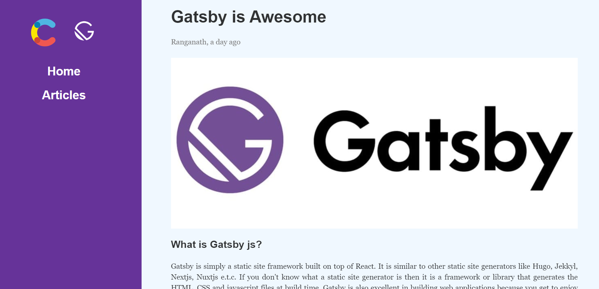

<!-- AUTO-GENERATED-CONTENT:START (STARTER) -->

  

<h1 align="center">
  Gatsby contentful CMS 
</h1>

## ⚽ gatsby-source-contentful

Source Data from contentful CMS into your Gatsby site using gatsby-source-contentful

## Demo 

## Reference

https://www.contentful.com/

https://www.gatsbyjs.org/packages/gatsby-source-contentful/

